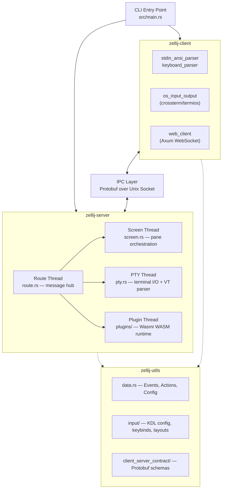
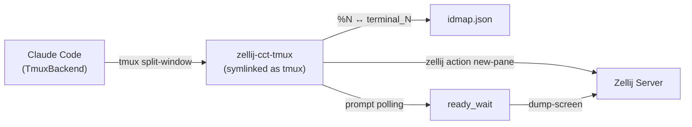

# Zellij — Project Architecture

## Overview

Zellij is a terminal multiplexer written in Rust (v0.45.0, edition 2021, MSRV 1.92+). It uses a **client-server architecture** where the CLI binary spawns a background server process that manages sessions, panes, tabs, and plugins. Clients connect over Unix domain sockets using Protobuf-serialized IPC. The plugin system runs sandboxed WASM modules via the Wasmi interpreter, enabling extensible UI components without native code.

## System Diagram

## Workspace Crates

| Crate | Type | Purpose |
|-------|------|---------|
| `zellij` (src/) | binary | CLI entry point — argument parsing, command routing |
| `zellij-client` | library | Terminal I/O, input parsing, IPC client, optional web client |
| `zellij-server` | library | Session management, pane orchestration, PTY, WASM plugin runtime |
| `zellij-utils` | library | Shared types (Events, Actions, Config), IPC protocol, KDL parsing |
| `zellij-tile` | library | Plugin SDK — `ZellijPlugin` trait, `register_plugin!` macro |
| `zellij-tile-utils` | library | Plugin utilities — ANSI text styling helpers |
| `zellij-cct-tmux` | binary | Tmux compatibility shim — translates `tmux` CLI calls to Zellij actions |
| `default-plugins/*` | WASM | 13 built-in plugins (tab-bar, status-bar, strider, session-manager, etc.) |
| `xtask` | binary | Build automation — Protobuf codegen, plugin compilation |

## Server Threading Model

The server runs six dedicated threads communicating via typed channels (`ThreadSenders`):

| Thread | Module | Responsibility |
|--------|--------|----------------|
| Route | `route.rs` (122KB) | Receives IPC messages, dispatches to subsystems |
| Screen | `screen.rs` (435KB) | Tab/pane state, layout, rendering to char buffer |
| PTY | `pty.rs` (103KB) | Spawns PTYs, reads streams, parses VT escape sequences |
| Plugin | `plugins/` (270KB) | Wasmi WASM execution, plugin lifecycle, worker pools |
| PTY Writer | `pty_writer.rs` | Dedicated writes to PTY file descriptors |
| Background Jobs | `background_jobs.rs` | Async task executor (tokio) |

→ *See [arch/server-threads.md](arch/server-threads.md) for details*

## Plugin System

Plugins compile to `wasm32-unknown-unknown` and run in the Wasmi interpreter (pure-Rust, no native code). Each plugin gets sandboxed memory and communicates with the host through Protobuf-serialized exports. The lifecycle is: Load → Update (event-driven) → Render → Unload. Worker threads handle background tasks.

→ *See [arch/plugin-system.md](arch/plugin-system.md) for details*

## Client-Server IPC

Clients connect via Unix socket (`/run/user/{uid}/zellij-session-{name}.sock`). Messages are Protobuf-encoded: `ClientToServerMsg` (actions, terminal input) and `ServerToClientMsg` (rendered frames, mode updates). Multiple clients can attach to a single session for collaborative multiplexing.

→ *See [arch/client-server-ipc.md](arch/client-server-ipc.md) for details*

## Pane Architecture

Panes are the core display unit. Two types exist: `TerminalPane` (PTY-connected shell) and `PluginPane` (WASM plugin). Panes live inside Tabs, managed as either tiled (Cassowary constraint solver) or floating (absolute positioning). Each `TerminalPane` holds a `Grid` — a `VecDeque<Line>` character buffer with scrollback.

→ *See [arch/pane-architecture.md](arch/pane-architecture.md) for details*

## Claude Code Tmux Shim (`zellij-cct-tmux`)

A Rust binary that impersonates `tmux` for Claude Code Agent Teams. When symlinked as `tmux` on `$PATH` inside a Zellij session, it intercepts every `tmux` CLI call Claude Code makes and translates them to equivalent `zellij action` subprocess calls. Claude Code sees a tmux-shaped interface; Zellij does the actual multiplexing.

The shim dispatches across three tiers: 17 real command handlers (delegate to `zellij action`), 9 stub categories (exit 0 for layout/style/config commands Zellij handles natively), and socket-scoped virtuals (`-L <socket>` commands for Claude Code's internal PTY management). A race-condition fix polls pane screen content for shell prompt readiness before forwarding `send-keys` to recently-created panes.

→ *See [arch/cct-tmux-shim.md](arch/cct-tmux-shim.md) for details*

## Configuration

Zellij uses KDL (KDL Document Language) for configuration and layouts. Files live under `~/.config/zellij/` — `config.kdl` for settings/keybindings, `layouts/*.kdl` for pane arrangements, and `themes/` for color schemes. Embedded defaults ship in `assets/`.

## Key Design Decisions

- **Why client-server**: Enables session persistence, multi-client attach, and process isolation
- **Why Wasmi (not Wasmtime)**: Pure-Rust interpreter avoids native code dependencies, simpler cross-compilation
- **Why KDL**: Purpose-built configuration language — cleaner than YAML/TOML for nested layout definitions
- **Why Protobuf IPC**: Structured, versioned protocol between client and server processes

## Technology Stack

| Layer | Technology |
|-------|-----------|
| Language | Rust (edition 2021) |
| Async runtime | tokio (multi-threaded) |
| Terminal control | crossterm, vte |
| WASM runtime | wasmi + wasmi_wasi |
| Serialization | prost (Protobuf), serde |
| Configuration | KDL |
| CLI parsing | clap |
| Web client | Axum (optional feature) |
